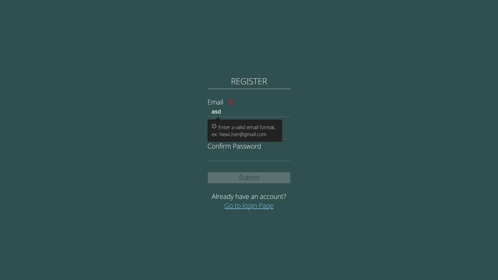
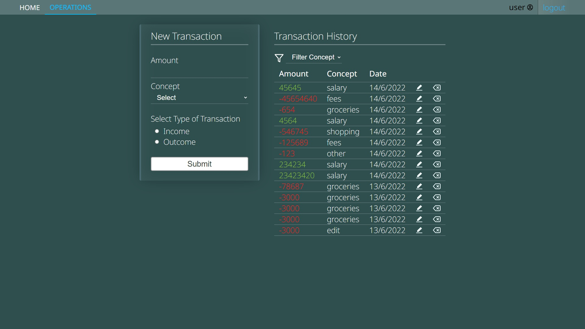
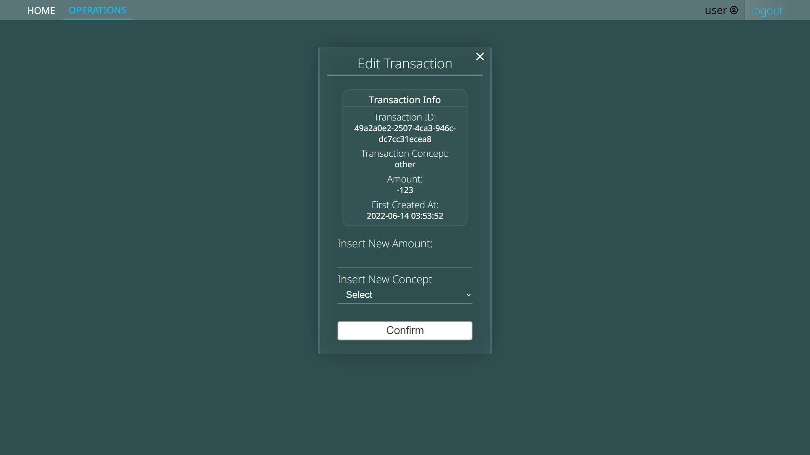
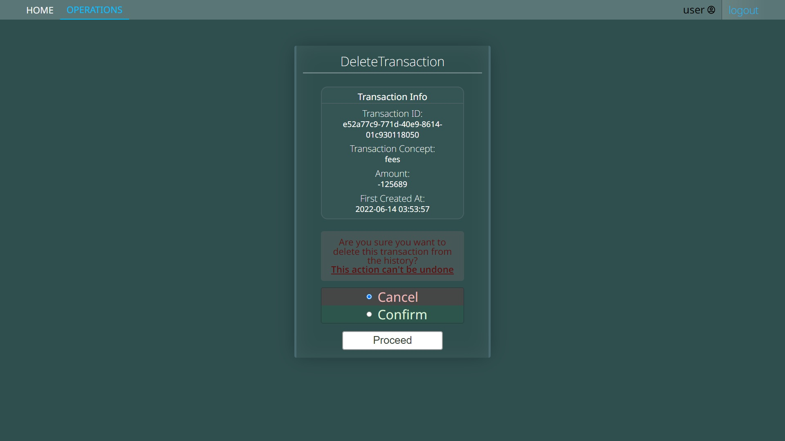
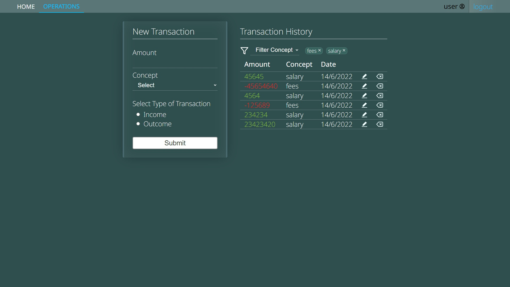
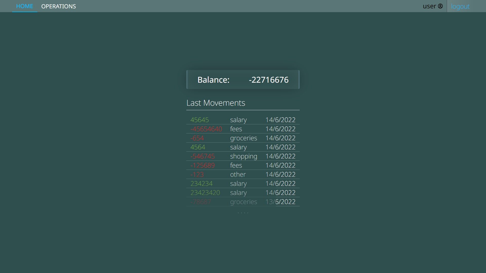

# stocktaking-client

Client-side app for managing personal budget

### [LAUNCH](https://stocktaking-client.vercel.app/)

Server side code [HERE](https://github.com/devtsp/stocktaking-server)

This repo contains a client-side app to allow authenticated users to handle/keep track of personal budget through CRUD operations against the backend API.

## Some of the app features:

- [x] Multi-device sessions
- [x] Session security (through http-only secure cookies, and token rotation/resuse detection)
- [x] Custom UI design, responsive and user-friendly

## Some todos:

- [ ] Add accesibility to CRUD ops (already implemented on register/auth forms)
- [ ] Add posibility to not-remember the session when closing tab (no auto-refresh on load)
- [ ] Add filtering by amount and date of transaction (by concept already implemented)
- [ ] Email confirmation on registration (to ultimately offer password resetting and user deletion)

## Some extra ✨ _fancy_ ✨ todos:

- [ ] Color themes
- [ ] A time/cashflow visual chart on homepage

---

### Previews!!

